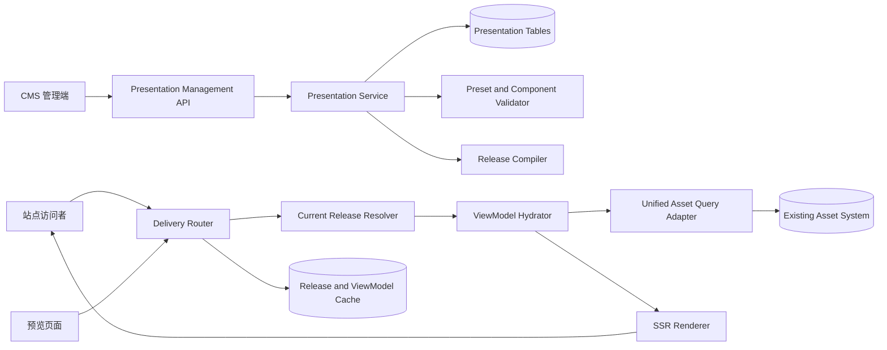

# CMS 呈现层前后端设计方案

> 状态：目标设计
>
> 范围：CMS 管理端、Presentation 后端、Delivery 前台
>
> 场景：资产驱动的博客与知识库

## 1. 结论

本方案只建设现有资产系统之上的 CMS 呈现层，不改变现有内容生产流程。

CMS 的职责是：

1. 选择工作区中已经发布的资产；
2. 使用博客或知识库预设组织页面；
3. 配置站点名称、导航、有限主题和字段展示；
4. 预览并发布不可变的站点配置版本；
5. 通过 Delivery 安全输出 HTML、搜索结果、RSS 和 Sitemap。

CMS 不负责：

- 创建、编辑、整理或派生资产；
- 改变资产所属资源模型；
- 自动识别、自动归类或自动移动文档；
- 管理资产的内部版本和内容发布流程；
- 建设分类法、工作流、自动化或新的内容存储；
- 提供任意页面、任意查询、任意代码和像素级自由搭建能力。

产品关系固定为：

```text
现有资产系统
  记录 / 编辑 / 现有处理流程 / 内容发布
                    |
                    v
CMS 呈现层
  选择已发布资产 / 配置站点 / 预览 / 发布呈现
                    |
                    v
Delivery
  博客 / 知识库 / 搜索 / RSS / Sitemap
```

核心原则是：**CMS 消费资产，不控制资产；站点配置可以回退，资产正文不复制。**

## 2. 设计边界

### 2.1 保持不变的现有流程

以下流程继续由现有模块负责，CMS 不修改其状态机、接口语义和用户入口：

| 现有能力 | CMS 的关系 |
| --- | --- |
| 通用文档、通用笔记和专业资产录入 | 只读取最终已发布版本 |
| 动态表单和字段校验 | 不介入 |
| 资产处理流程 | 不介入 |
| 工作版本、历史版本和内容发布 | 不介入，只读取当前发布指针 |
| 资源模型和模型版本 | 只读取模型信息、`frontend` outlet 和字段定义 |
| 文件夹 | 只属于后台内容管理，不作为前台目录 |
| 文档父子关系 | 知识库目录只读使用 |
| 标签 | 只读用于筛选和标签页，不新增标签体系 |
| 权限和统一查询 | Delivery 必须复用，不建立独立数据权限 |
| 全文与语义检索 | 只调用现有查询能力，不新建检索内核 |

CMS 接入现有系统时，只允许增加必要的查询适配、展示配置和站点发布代码。不得借 CMS 项目重构资产、资源模型、处理流程或内容发布流程。

### 2.2 CMS 自己拥有的数据

CMS 只拥有小体量的呈现配置：

- 站点身份和访问模式；
- 博客或知识库模式；
- 资产选择范围；
- 页面预设和组件参数；
- 导航；
- 主题 Token；
- 资源模型字段的展示白名单与显示方式；
- 站点草稿、Release、预览令牌和路由缓存。

资产标题、正文、附件、标签、父子关系和业务字段仍以资产系统为唯一权威来源。

### 2.3 首期约束

- 一个工作区最多一个启用的 CMS 站点；
- 一个站点只能选择博客或知识库一种模式；
- 一个站点同时只有一个线上 Release；
- 站点只能展示当前工作区的资产；
- CMS 只能展示已发布资产；
- 站点草稿预览也不读取资产工作版本；
- 第一版不支持自定义域名，使用平台统一域名和 `site_key`；
- 第一版不支持插件、自定义脚本、自定义 CSS、自定义组件和任意页面模板；
- 页面、组件、导航和主题均使用后端注册的固定 Schema。

这些约束保证 CMS 是轻量呈现层，而不是通用建站系统。

> 修订（2026-09-02，二期《公开站点样式与页面能力扩展设计方案》）："自定义 CSS"一项升级为**受控白名单子集（L2 custom_css）**——词法级三层白名单清理器（属性/选择器/@media 条件；禁 position:fixed、一切 url()、@import、@keyframes 等）+ 写入侧存规范输出 + 渲染侧二次清理 + 预览 + Release 快照。自定义脚本、自定义组件与任意页面模板的红线不变。安全分析见该方案 §4 与完整审计报告 §4。

## 3. 现有代码基础与最小改动

### 3.1 可直接复用

| 当前能力 | 代码位置 | CMS 用法 |
| --- | --- | --- |
| 工作区与成员 | `content.workspaces`、`content.workspace_members` | 站点归属和管理权限 |
| 资产列表与详情 | `internal/asset/member.go` | 管理端选择内容 |
| 公开资产基础查询 | `internal/httpapi/public_assets.go` | 仅作为行为参考，不直接作为 Delivery |
| 资源模型版本 | `internal/resourcemodel` | 校验可展示字段和类型 |
| 通用文档模型 | `builtin_document` | 博客文章和知识库正文的默认内容模型 |
| 标签 | `asset_versions.tags` | 标签筛选和标签聚合页 |
| 文档父子关系 | `content.document_parents` | 知识库树和面包屑 |
| 查询与检索 | `internal/retrieval` 和工作区 Query API | 站内搜索和相关推荐 |
| 审计与 Outbox | 现有基础设施 | 站点发布审计和缓存失效 |

现有资源模型策略校验已经接受 `frontend` outlet，但内置模型种子尚未启用它。CMS 迁移只调整展示资格：为 `builtin_document` 和 `builtin_faq` 启用 `frontend`，`builtin_note` 默认保持关闭，专业模型继续由现有模型配置决定是否允许进入 CMS。该开关不改变模型字段、录入表单和资产处理流程。

### 3.2 必须新增

当前仓库没有正式 Presentation 领域和 CMS 前端，需要新增：

1. `presentation` 数据表和领域服务；
2. 固定的博客、知识库预设；
3. 固定组件注册表和配置校验器；
4. 站点 Revision、Preview、Release 和回退；
5. CMS 管理 API；
6. Delivery Resolver、Hydrator、ViewModel 和 HTML Renderer；
7. CMS 管理端前端；
8. 公开博客和知识库前端模板。

### 3.3 必须隔离的旧接口

`internal/httpapi/public_assets.go` 当前会返回公开资产的完整动态 `fields`。CMS 页面不能直接使用这个响应，否则站点组件可能拿到未配置展示的字段。

Delivery 必须通过新的 `delivery.QueryAdapter` 调用统一查询服务，并根据站点 Release 中的字段白名单生成 ViewModel。模板只能接收 ViewModel，不能接收原始资产 DTO。

这是一处 CMS 出口隔离，不改变现有资产写入和处理流程。

## 4. 核心概念

### 4.1 工作区与站点

工作区不是知识库，也不是博客。

工作区是现有资产、成员和权限的管理边界；站点是工作区之上的一个可选呈现配置。工作区可以没有站点，站点也不会展示工作区中的全部内容。

```text
工作区
├─ 内部资产、未发布内容、文件夹和成员
└─ CMS 站点（可选）
   ├─ 内容范围：已发布资产的子集
   ├─ 模式：博客或知识库
   └─ 当前线上 Release
```

### 4.2 通用文档

通用文档可以直接以 CMS 形式展示，不需要转换为专业资产。

默认映射：

| 通用文档数据 | CMS 用途 |
| --- | --- |
| `title` | 卡片标题、详情标题、SEO 标题 |
| `markdown` | 文章或知识文档正文 |
| `tags` | 筛选、标签页和相关推荐 |
| `updated_at` | 更新时间 |
| 附件 | 经现有附件授权后展示下载或媒体入口 |
| `parent_asset_id` | 知识库目录层级 |

通用笔记只有在现有内容流程将其明确发布且站点内容范围包含它时才可以展示。CMS 不自动发布笔记，也不自动把笔记转换成文档。

### 4.3 文件夹、标签和知识库目录

三者不能混用：

| 概念 | 作用 | CMS 是否使用 |
| --- | --- | --- |
| 文件夹 | 后台整理位置 | 不用于公开导航、URL 或知识库目录 |
| 标签 | 语义筛选 | 用于标签筛选、标签页和相关推荐 |
| 文档父子关系 | 阅读层级 | 作为知识库目录和面包屑的唯一来源 |

文件夹名称和层级不进入 Delivery 响应，避免把内部管理结构暴露到公开站点。

博客导航由站点配置手工维护；内容聚合可以按资源模型和标签筛选。知识库导航由手工顶层导航与现有文档父子树组合生成，不建设第二套目录树。

## 5. 用户流程

### 5.1 首次创建站点

```text
进入工作区的“呈现”
→ 选择博客或知识库
→ 设置站点名称和访问模式
→ 选择允许展示的资源模型或具体资产
→ 应用官方预设生成第一份草稿
→ 预览
→ 发布呈现
```

创建站点不会创建、修改或发布任何资产。

### 5.2 日常内容更新

内容编辑和发布继续在现有资产界面完成：

```text
现有资产界面发布内容
→ 资产当前发布版本发生变化
→ Delivery 查询和缓存更新
→ 符合站点内容范围的内容自动出现或更新
```

新增文章、修改正文、归档内容通常不需要重新发布站点。只有站点结构、导航、主题、内容范围或字段展示配置变化时，才发布新的 CMS Release。

### 5.3 修改站点

```text
打开当前草稿
→ 修改受控配置
→ 后端创建新 Revision
→ 校验真实内容样本
→ 生成预览令牌
→ 预览桌面和移动端
→ 发布新 Release
```

所有修改均落成完整 Revision，不直接覆盖线上配置。

### 5.4 回退

回退某个历史 Release 时，后端将历史配置克隆为新的草稿 Revision。用户重新校验并发布后才切换线上版本。

回退站点不会回退资产内容。

## 6. 总体架构



### 6.1 写路径

CMS 管理端只写 Presentation 表：

```text
受控操作
→ 权限与 ETag 校验
→ 创建完整 Revision
→ Schema 校验
→ 真实资产样本校验
→ 预览
→ 编译 Release
→ 原子切换 current_release_id
```

### 6.2 读路径

Delivery 不直接查询资产主表：

```text
域名和路径解析
→ 读取当前 Release
→ 解析页面和组件
→ QueryAdapter 按访问主体查询已发布资产
→ 按 Release 字段白名单生成 ViewModel
→ SSR 渲染
→ 返回 HTML
```

## 7. Presentation 后端设计

### 7.1 数据表

#### `presentation.sites`

| 字段 | 说明 |
| --- | --- |
| `id` | 站点 ID |
| `organization_id` | 企业范围 |
| `workspace_id` | 所属工作区，唯一启用站点 |
| `site_key` | 平台域名下的稳定键 |
| `name` | 站点名称 |
| `mode` | `blog` 或 `knowledge` |
| `access_mode` | `public` 或 `login` |
| `status` | `active` 或 `disabled` |
| `current_draft_revision_id` | 当前草稿 |
| `current_release_id` | 当前线上版本 |
| `created_by/created_at/updated_at` | 审计字段 |

约束：

- `site_key` 全局唯一，创建后不可直接修改；
- 同一工作区最多一个 `active` 站点；
- 站点只能引用同一工作区的数据；
- `disabled` 站点的 Delivery 返回 `404`。

#### `presentation.site_revisions`

| 字段 | 说明 |
| --- | --- |
| `id` | Revision ID |
| `site_id` | 所属站点 |
| `revision_no` | 单站点递增版本号 |
| `status` | `draft/validated/released/superseded` |
| `config` | 完整 JSON 配置快照 |
| `schema_version` | 配置 Schema 版本 |
| `config_checksum` | SHA-256 |
| `based_on_revision_id` | 来源 Revision |
| `created_by/created_at` | 审计字段 |

每次配置操作创建新 Revision。数据库不保存 JSON Patch 链作为权威状态，避免恢复和迁移时依赖完整操作历史。

#### `presentation.site_releases`

| 字段 | 说明 |
| --- | --- |
| `id` | Release ID |
| `site_id/revision_id` | 站点和来源 Revision |
| `release_no` | 单站点递增版本 |
| `manifest` | 编译后的不可变运行清单 |
| `manifest_checksum` | SHA-256 |
| `published_by/published_at` | 发布审计 |

Release 只冻结站点配置和组件版本，不复制资产正文。组件 Binding 运行时读取资产当前发布版本。

#### `presentation.route_entries`

| 字段 | 说明 |
| --- | --- |
| `release_id` | 所属 Release |
| `path` | 规范化路径 |
| `route_type` | `home/list/detail/search/tag/rss/sitemap/login` |
| `page_key` | 对应预设页面 |
| `target_asset_id` | 可选的固定资产目标 |

静态路由在发布时编译。资产详情路由通过固定模式和资产 ID 动态解析，不为每篇内容复制一条永久路由。

#### `presentation.preview_tokens`

| 字段 | 说明 |
| --- | --- |
| `token_hash` | 令牌哈希，不保存明文 |
| `site_id/revision_id` | 预览范围 |
| `created_by` | 创建人 |
| `expires_at` | 最长 30 分钟 |
| `revoked_at` | 撤销时间 |

### 7.2 Revision 配置结构

```json
{
  "schema_version": 1,
  "site": {
    "name": "产品技术文档",
    "description": "产品使用与开发文档",
    "mode": "knowledge",
    "access_mode": "public",
    "language": "zh-CN"
  },
  "brand": {
    "logo_attachment_id": null,
    "favicon_attachment_id": null
  },
  "theme": {
    "preset": "clean",
    "tokens": {
      "accent": "#1f6f5f",
      "surface": "#ffffff",
      "text": "#202124",
      "muted": "#667085",
      "border": "#d9dee5",
      "font_family": "system"
    }
  },
  "content_scope": {
    "resource_model_ids": ["model-id"],
    "content_kinds": ["document", "faq"],
    "required_tags": [],
    "included_asset_ids": [],
    "excluded_asset_ids": []
  },
  "model_views": {
    "model-id": {
      "card_fields": [],
      "detail_fields": [],
      "filter_fields": []
    }
  },
  "navigation": [
    {"type": "page", "label": "首页", "target": "home"},
    {"type": "page", "label": "文档", "target": "content_index"}
  ],
  "pages": {
    "home": {"preset": "knowledge_home", "components": []},
    "content_index": {"preset": "knowledge_index", "components": []},
    "content_detail": {"preset": "knowledge_detail", "components": []},
    "search": {"preset": "search_results", "components": []}
  }
}
```

配置限制：

- JSON 总体积不超过 256 KB；
- 导航最多 30 项、深度最多 3 层；
- 单页最多 20 个组件；
- 只能引用组件注册表中的 `type + version`；
- 不能携带 HTML、JavaScript、CSS、SQL、模板表达式或远程脚本 URL；
- 所有资产、模型和附件引用必须属于当前工作区或允许的组织级内置资源。

### 7.3 受控配置操作

管理 API 不接受任意 JSON Patch，只接受固定命令：

| 操作 | 作用 |
| --- | --- |
| `set_site_identity` | 名称、说明和语言 |
| `set_mode` | 应用博客或知识库预设到新草稿 |
| `set_access_mode` | 公开或登录访问 |
| `set_content_scope` | 设置模型、内容类型、标签和资产范围 |
| `replace_navigation` | 替换完整导航并校验深度和目标 |
| `set_theme_tokens` | 修改允许的 Theme Token |
| `configure_model_view` | 设置动态字段展示白名单 |
| `set_component_enabled` | 启用或停用预设组件 |
| `reorder_slot` | 在固定 Slot 内调整组件顺序 |
| `set_component_options` | 修改组件注册表允许的参数 |

每个命令必须携带当前 Revision 的 ETag。基线变化时返回 `409 revision_conflict`，前端重新加载后再提交。

### 7.4 校验

发布前依次执行：

1. 站点和 Revision 归属校验；
2. 配置 JSON Schema 校验；
3. 页面与组件版本校验；
4. Slot 和组件数量限制；
5. 导航目标和环校验；
6. 内容范围中的资源模型存在性校验；
7. `model_views` 字段是否存在、类型是否可展示；
8. 附件引用和媒体类型校验；
9. 访问模式与资产可见性样本校验；
10. 使用真实已发布资产生成桌面和移动端样本 ViewModel；
11. 空列表、缺失标题、无正文和失效父级告警；
12. 路由冲突、RSS 和 Sitemap 编译校验。

错误阻止发布；告警允许发布，但必须在管理端明确展示。

### 7.5 发布

站点发布事务：

1. 锁定站点和目标 Revision；
2. 重新执行完整校验；
3. 编译不可变 Manifest；
4. 插入 `site_releases` 和静态 `route_entries`；
5. 原子更新 `sites.current_release_id`；
6. 写入审计和现有 Outbox；
7. 提交后清理站点路由和 Release 缓存。

站点发布不会更新 `asset.assets` 或 `asset.asset_versions`。

## 8. Delivery 后端设计

### 8.1 职责划分

| 模块 | 职责 |
| --- | --- |
| `Resolver` | 根据 `site_key + path` 找到站点、Release 和页面 |
| `AccessGuard` | 校验站点访问模式和登录状态 |
| `QueryAdapter` | 调用统一查询能力获取当前可见的已发布资产 |
| `Hydrator` | 将页面、组件和资产组装成受控 ViewModel |
| `Renderer` | 使用注册模板生成 HTML |
| `SearchAdapter` | 调用现有全文或混合检索，并限制站点内容范围 |
| `Cache` | 缓存 Release、路由和可安全共享的 ViewModel |

Delivery 不能直接拼接资产主表查询，不能自行定义另一套资产 ACL，也不能把完整动态字段交给模板。

### 8.2 CMS 可见性规则

一个资产进入 Delivery 必须同时满足：

```text
资产属于站点工作区
∩ 资产存在当前发布版本
∩ 资产未归档或删除
∩ 资源模型当前版本启用 frontend outlet
∩ 资产匹配站点 content_scope
∩ 请求主体满足资产现有可见性
∩ 字段进入当前 Release 的展示白名单
```

站点访问模式不能扩大资产权限：

| 站点模式 | 可展示资产 |
| --- | --- |
| `public` | 仅现有规则允许匿名访问的已发布资产 |
| `login` | 已登录主体按现有权限可见的已发布资产 |

`private`、`internal` 和资产工作版本不进入 CMS Delivery。

### 8.3 内容 Binding

组件只能使用声明式 Binding：

```json
{
  "source": "published_assets",
  "filters": {
    "resource_model_ids": ["model-id"],
    "content_kinds": ["document"],
    "tags_any": ["release-note"]
  },
  "sort": "updated_at_desc",
  "limit": 12
}
```

允许的过滤条件：

- `resource_model_ids`；
- `content_kinds`；
- `asset_ids`；
- `tags_any/tags_all`；
- `parent_asset_id`；
- 关键词搜索；
- 发布或更新时间区间。

允许的排序：

- 发布时间倒序；
- 更新时间倒序；
- 标题正序；
- 固定资产 ID 顺序；
- 搜索相关度。

不允许前端提交 SQL、字段表达式、任意关联查询或无限数量结果。列表组件单次最多返回 50 项，并使用游标分页。

### 8.4 ViewModel

模板接收的资产详情示例：

```json
{
  "id": "asset-id",
  "content_kind": "document",
  "title": "部署指南",
  "summary": "...",
  "body_html": "<p>...</p>",
  "tags": ["部署"],
  "updated_at": "2026-08-28T10:00:00Z",
  "breadcrumbs": [],
  "display_fields": [
    {"key": "version", "label": "适用版本", "type": "text", "value": "v2"}
  ],
  "attachments": [],
  "related_items": []
}
```

规则：

- Markdown 在服务端使用固定渲染器转换并清理 HTML；
- `body_html` 只允许安全标签和属性；
- 动态字段按 Release 白名单逐个映射，不传原始 `fields`；
- 附件必须返回经过授权的短期访问 URL；
- 相关推荐仍需逐项复核当前访问权限；
- 空字段直接省略，模板不得显示无意义占位。

### 8.5 路由

#### 通用路由

| 路径 | 页面 |
| --- | --- |
| `/` | 首页 |
| `/search` | 搜索 |
| `/tags/{tag}` | 标签聚合 |
| `/login` | 登录入口，仅登录站点 |

#### 博客路由

| 路径 | 页面 |
| --- | --- |
| `/articles` | 文章列表 |
| `/articles/{assetId}` | 文章详情 |
| `/articles/{assetId}/{slug}` | 带可读 Slug 的规范详情 |
| `/rss.xml` | RSS |
| `/sitemap.xml` | Sitemap |

#### 知识库路由

| 路径 | 页面 |
| --- | --- |
| `/docs` | 文档目录 |
| `/docs/{assetId}` | 文档详情 |
| `/docs/{assetId}/{slug}` | 带可读 Slug 的规范详情 |
| `/sitemap.xml` | 公开知识库 Sitemap |

资产 ID 是稳定路由身份，Slug 只用于可读性。Slug 不匹配当前标题时，Delivery 返回 `301` 到当前规范地址，因此不需要修改资产表增加 CMS Slug 字段。

### 8.6 缓存

| 缓存 | Key | 策略 |
| --- | --- | --- |
| 站点解析 | `site_key` | Release 切换时主动失效 |
| Release Manifest | `release_id` | 不可变，可长缓存 |
| 静态页面结构 | `release_id + page_key` | 不可变，可长缓存 |
| 公开列表 ViewModel | `release_id + binding + cursor` | 短 TTL，内容事件失效 |
| 公开详情 ViewModel | `release_id + asset_id + published_version_id` | 版本变化后自然换 Key |
| 登录页面 | 用户范围 | 默认不进入共享缓存 |

资产归档或权限收紧必须在下一次查询立即生效。即使页面缓存存在，也不能绕过统一查询的实时对象复核。

## 9. CMS 管理 API

### 9.1 站点与草稿

| 方法 | 路径 | 作用 |
| --- | --- | --- |
| `POST` | `/api/frontend/workspaces/{workspaceId}/site` | 创建站点并应用官方预设 |
| `GET` | `/api/frontend/workspaces/{workspaceId}/site` | 获取站点、草稿和线上摘要 |
| `PATCH` | `/api/frontend/sites/{siteId}` | 启停站点或修改基础信息 |
| `GET` | `/api/frontend/sites/{siteId}/draft` | 获取当前完整草稿和 ETag |
| `POST` | `/api/frontend/sites/{siteId}/draft/operations` | 应用一条受控配置操作 |
| `POST` | `/api/frontend/site-revisions/{revisionId}/validate` | 校验并返回错误、告警和样本 |
| `POST` | `/api/frontend/site-revisions/{revisionId}/preview-token` | 创建短期预览令牌 |
| `POST` | `/api/frontend/site-revisions/{revisionId}/publish` | 发布站点 Release |
| `GET` | `/api/frontend/sites/{siteId}/revisions` | Revision 历史 |
| `GET` | `/api/frontend/sites/{siteId}/releases` | Release 历史 |
| `POST` | `/api/frontend/site-releases/{releaseId}/restore` | 克隆历史 Release 为新草稿 |

### 9.2 CMS 配置数据

| 方法 | 路径 | 作用 |
| --- | --- | --- |
| `GET` | `/api/frontend/presentation/presets` | 博客和知识库预设 |
| `GET` | `/api/frontend/presentation/component-catalog` | 固定组件及参数 Schema |
| `GET` | `/api/frontend/sites/{siteId}/content-options` | 可选模型、标签和已发布资产摘要 |
| `GET` | `/api/frontend/sites/{siteId}/content-sample` | 按当前内容范围返回预览样本 |
| `GET` | `/api/frontend/sites/{siteId}/route-check` | 检查路由和失效链接 |

`content-options` 只用于选择已发布内容，不提供资产编辑或发布命令。

### 9.3 Delivery API

| 方法 | 路径 | 作用 |
| --- | --- | --- |
| `GET` | `/api/delivery/v1/sites/{siteKey}/resolve?path=...` | 返回页面 ViewModel，供预览和诊断 |
| `GET` | `/api/delivery/v1/sites/{siteKey}/search` | 站内搜索 |
| `GET` | `/api/delivery/v1/sites/{siteKey}/navigation` | 当前可见导航和知识库树 |
| `GET` | `/api/delivery/v1/sites/{siteKey}/rss.xml` | 博客 RSS |
| `GET` | `/api/delivery/v1/sites/{siteKey}/sitemap.xml` | Sitemap |

正式站点 HTML 路由与 Delivery API 共用 Resolver 和 Hydrator，不能实现两套可见性判断。

### 9.4 API 规则

- 列表全部使用游标分页；
- 写接口要求 `Idempotency-Key`；
- 草稿修改要求 `If-Match`；
- 错误返回稳定 `code + message + field_errors`；
- 发布返回 `release_id + release_no + published_at`；
- 预览令牌只通过 Header 或 HttpOnly Cookie 传递，不写入公开 URL 日志；
- OpenAPI 单独维护 CMS 管理和 Delivery 契约。

## 10. CMS 管理端前端

### 10.1 技术形态

仓库当前没有正式 Web 前端。建议 CMS 管理端使用 React + TypeScript，以独立模块消费 `/api/frontend`；公开 Delivery 首期使用 Go SSR 模板和少量渐进增强脚本，减少运行时和 SEO 复杂度。

管理端不保存权威站点配置。所有控件、默认值和校验约束来自后端 Preset、Component Catalog 和 Revision API。

### 10.2 信息架构

```text
工作区
└─ 呈现
   ├─ 概览
   ├─ 内容范围
   ├─ 导航
   ├─ 页面与模块
   ├─ 外观
   ├─ 预览
   └─ 发布记录
```

不在 CMS 导航中出现资产录入、文档整理、资源模型设计、文件夹管理和内容发布。这些能力继续留在原有产品入口。

### 10.3 概览

展示：

- 站点名称、模式、访问方式和线上地址；
- 当前草稿是否有未发布修改；
- 当前线上 Release；
- 内容范围内的已发布资产数量；
- 最近一次校验错误和告警；
- `预览`、`发布呈现`、`停用站点`三个明确命令。

不得用营销式首页或大面积装饰卡片替代工作台。

### 10.4 内容范围

用户可以：

- 勾选已启用 `frontend` outlet 的资源模型；
- 选择内容类型；
- 使用现有标签包含或排除内容；
- 手工包含或排除少量资产；
- 查看当前范围命中的已发布资产样本。

页面只显示资产摘要和“在资产模块中查看”链接，不提供编辑正文和发布内容按钮。

### 10.5 导航

导航编辑器只支持：

- 系统页面：首页、文章、文档、搜索；
- 固定资产详情链接；
- 标签聚合页；
- 合法的站外链接；
- 最多三级拖动排序。

知识库文档树不在这里逐节点复制编辑。导航只配置顶层入口，文档层级读取现有 `parent_asset_id`。

### 10.6 页面与模块

页面使用官方预设生成的固定 Slot。用户可以启停模块、修改有限参数并在同一个 Slot 内调整顺序。

界面采用：

- 左侧页面列表；
- 中间真实预览；
- 右侧当前模块属性面板；
- 顶部桌面、平板、移动端分段预览控件；
- 撤销和重做图标按钮；
- 保存状态和 Revision 冲突提示。

不提供空白画布、自由定位、嵌套容器、任意尺寸和代码编辑器。

### 10.7 外观

只提供有限 Theme Token：

- 品牌色；
- 页面背景和内容表面；
- 主文字、次文字和边框色；
- 系统字体组；
- 内容最大宽度；
- 紧凑、标准两种密度；
- Logo、Favicon 和分享图。

颜色使用色板输入，模式使用分段控件，开关使用 Toggle，数值使用 Stepper 或 Slider。前端不能提交自定义 CSS。

### 10.8 预览与发布

预览必须使用真实 Delivery 页面，而不是管理端自己模拟渲染。

发布抽屉展示：

- 相比线上 Release 的配置差异；
- 页面、导航和主题变化；
- 内容范围变化及样本数量；
- 校验错误和告警；
- 桌面与移动端截图或可访问预览链接。

主命令使用“发布呈现”，避免与资产模块的“发布内容”混淆。

## 11. 公开前端设计

### 11.1 通用页面外壳

博客和知识库共用：

- 固定高度站点头部；
- Logo、站点名和主导航；
- 搜索入口；
- 登录状态入口；
- 主内容区；
- 简洁页脚；
- 404、无权限和系统错误页面。

页面风格应安静、清晰、适合连续阅读。首屏直接展示站点名称和主要内容，不使用营销落地页式巨型 Hero、装饰性渐变或无关视觉元素。

### 11.2 博客预设

#### 首页

- 紧凑站点介绍；
- 精选内容，可选；
- 最新文章列表；
- 标签筛选，可选；
- 分页入口。

#### 列表

- 标题、摘要、更新时间、标签；
- 列表或紧凑网格切换由预设固定；
- 游标分页；
- 空状态不显示空模块。

#### 详情

- 标题、更新时间、标签和正文；
- 允许展示的结构化字段；
- 附件；
- 正文目录；
- 上一篇、下一篇和相关推荐；
- 规范 URL 和分享元数据。

### 11.3 知识库预设

#### 首页

- 站点名称和搜索；
- 顶层文档入口；
- 最近更新；
- 常用标签，可选。

#### 文档目录

- 桌面端左侧固定宽度树；
- 移动端使用抽屉；
- 树节点来自 `parent_asset_id`；
- 同级默认按标题排序，固定顺序可由站点配置覆盖；
- 无父级或父级不可见的文档进入“其他文档”，不能造成整页失败。

#### 文档详情

- 面包屑；
- 左侧文档树；
- 中间 Markdown 正文；
- 右侧页内标题目录，窄屏隐藏；
- 上一篇和下一篇；
- 相关推荐；
- 登录站点禁止公共搜索引擎索引。

### 11.4 搜索

搜索只覆盖当前站点内容范围和当前访问者可见资产。

结果包含：

- 标题；
- 高亮摘要；
- 内容类型；
- 标签；
- 所在知识库路径；
- 更新时间。

输入防抖 250-400ms，服务端限制查询长度、分页大小和高亮片段数量。空查询显示推荐内容，零结果提供清除筛选和返回目录入口。

### 11.5 SSR、SEO 与可访问性

- 公开站点首屏使用 SSR；
- 标题、描述、Canonical、Open Graph 由服务端生成；
- 博客提供 RSS 和 Sitemap；
- 登录站点返回 `noindex`，不生成公开 RSS；
- 标题层级、Landmark、焦点、键盘导航和颜色对比满足 WCAG 2.1 AA；
- 图片有稳定尺寸和替代文本，避免布局跳动；
- Markdown 表格和代码块在移动端可横向滚动，不撑破页面；
- 页面主要内容在无 JavaScript 时仍可阅读。

## 12. 固定组件目录

### 12.1 通用组件

| 组件 | 用途 | 主要参数 |
| --- | --- | --- |
| `site_header@1` | 站点头部 | Logo、导航、搜索开关 |
| `site_footer@1` | 页脚 | 短说明、受限链接 |
| `content_list@1` | 内容列表 | Binding、每页数量、摘要开关 |
| `content_detail@1` | 资产详情 | 模型展示配置 |
| `search_box@1` | 搜索输入 | 占位文本 |
| `search_results@1` | 搜索结果 | 每页数量、筛选开关 |
| `tag_filter@1` | 标签筛选 | 数量上限、排序 |
| `breadcrumbs@1` | 面包屑 | 最大深度 |
| `related_content@1` | 相关推荐 | 数量、匹配方式 |
| `table_of_contents@1` | 页内目录 | 标题深度 |

### 12.2 博客组件

| 组件 | 用途 |
| --- | --- |
| `featured_content@1` | 手工选择少量精选文章 |
| `latest_articles@1` | 最新文章 |
| `article_pager@1` | 上一篇和下一篇 |
| `tag_cloud@1` | 小规模标签入口 |

### 12.3 知识库组件

| 组件 | 用途 |
| --- | --- |
| `document_tree@1` | 文档父子树 |
| `document_children@1` | 当前文档子节点 |
| `recently_updated@1` | 最近更新文档 |
| `document_pager@1` | 目录顺序中的上一篇和下一篇 |

组件实现必须满足：

- 后端 Schema、Hydrator 和模板版本一一对应；
- 未知组件或未知版本不能发布；
- 组件参数不能扩大内容范围和字段白名单；
- 组件内部不能再嵌套任意组件；
- 不增加富文本页面内容库，长内容必须来自资产正文。

## 13. 权限与安全

### 13.1 管理权限

CMS 增加最少两个动作：

| 动作 | 用途 |
| --- | --- |
| `site.edit` | 创建站点、修改草稿、预览 |
| `site.publish` | 发布、停用和回退线上呈现 |

动作映射复用现有工作区成员授权，不在 Presentation 内定义新的成员角色体系。

### 13.2 数据安全

- Delivery 每次查询都携带站点、工作区和访问主体；
- 站点配置中的工作区 ID、主体 ID不能由组件参数覆盖；
- 所有固定资产引用在保存、校验、发布和读取时检查归属；
- 动态字段默认不展示，必须进入 `model_views` 白名单；
- Markdown 和短说明统一清理 HTML；
- 外链增加安全属性并限制协议；
- 预览令牌短期、可撤销、不可复用到其他 Revision；
- 登录站点禁止共享页面缓存；
- 附件下载复用现有授权和短期签名 URL；
- 错误页不能回显内部表名、配置 JSON 或资产不可见原因。

### 13.3 HTTP 安全头

公开 HTML 至少设置：

- 严格 CSP，不允许内联远程脚本；
- `X-Content-Type-Options: nosniff`；
- `Referrer-Policy`；
- `Permissions-Policy`；
- 合理的 `frame-ancestors`；
- 登录 Cookie 使用 `HttpOnly + Secure + SameSite`。

## 14. 错误处理与可观测性

### 14.1 用户可见错误

| 场景 | 行为 |
| --- | --- |
| 站点不存在或停用 | 404 |
| 未登录访问登录站点 | 跳转登录并保留安全回跳地址 |
| 无权访问某资产 | 404，避免暴露存在性 |
| 资产已归档 | 404，并从列表和搜索移除 |
| Revision 冲突 | 管理端提示重新加载和比较 |
| 组件配置失效 | 阻止发布；线上继续使用旧 Release |
| 单个动态字段失效 | 省略字段并记录指标，不泄露原始值 |
| 搜索暂时不可用 | 页面仍可浏览，显示可重试状态 |

### 14.2 指标

- Delivery 请求量、状态码和 P95 延迟；
- SSR 渲染耗时；
- QueryAdapter 查询耗时和分页量；
- Release 发布成功率和耗时；
- Revision 校验错误分布；
- 404、失效导航和不可见父节点数量；
- 搜索零结果率；
- 缓存命中率；
- ViewModel 字段被安全省略的次数。

### 14.3 日志和审计

站点创建、配置修改、预览令牌创建、发布、停用和回退记录成员、站点、Revision、Release、请求 ID 和时间。日志不记录预览令牌明文、资产正文和附件签名 URL。

## 15. 代码组织

建议新增：

```text
internal/presentation/
  types.go             # Site、Revision、Release 领域类型
  schema.go            # Revision 配置 Schema
  catalog.go           # 固定组件目录
  presets.go           # 博客和知识库官方预设
  repository.go        # Presentation 表读写
  service.go           # 受控配置操作
  validator.go         # 配置和真实样本校验
  compiler.go          # Revision -> Release Manifest
  preview.go           # 预览令牌
  publisher.go         # 原子发布和回退

internal/delivery/
  resolver.go          # 站点与路由解析
  access.go            # 站点访问校验
  query_adapter.go     # 只调用统一资产查询
  hydrator.go          # 组件 ViewModel
  search.go            # 站点范围搜索适配
  renderer.go          # SSR 渲染
  cache.go             # Release 和 ViewModel 缓存
  templates/           # 固定 HTML 模板和组件 Partial
  static/              # 版本化 CSS 和渐进增强脚本

internal/httpapi/
  frontend_sites.go
  frontend_site_revisions.go
  frontend_site_releases.go
  frontend_presentation_catalog.go
  delivery.go

web/cms-admin/
  src/api/
  src/pages/site/
  src/components/presentation/
  src/state/
```

新增 OpenAPI：

```text
openapi-cms-v1.yaml
openapi-delivery-v1.yaml
```

现有代码只做最小接入：

- `internal/httpapi/router.go` 注册 CMS 和 Delivery 路由；
- 统一查询服务提供 Delivery 所需的已发布资产投影接口；
- 现有资源模型读取接口为字段展示校验提供字段定义；
- CMS 迁移为内置通用文档和 FAQ 启用 `frontend` outlet，通用笔记保持关闭；
- 现有事件订阅用于清理 Delivery 内容缓存；
- 现有鉴权增加 `site.edit/site.publish` 动作映射。

不修改 `asset_prepare`、内容录入、文档编辑、文件夹操作和资产处理流程。

## 16. 数据库迁移

按以下顺序增加迁移：

1. 创建 `presentation` schema；
2. 创建 `sites/site_revisions/site_releases/route_entries/preview_tokens`；
3. 增加唯一索引、工作区外键和 Revision/Release 递增约束；
4. 增加预览令牌过期索引；
5. 增加站点发布审计事件类型；
6. 为内置通用文档和 FAQ 启用 `frontend` outlet，不修改其字段和表单；
7. 不迁移、不复制现有资产数据；
8. 不根据文件夹自动生成站点或知识库目录。

首个站点由用户在 CMS 管理端显式创建。系统不为所有工作区自动生成空站点。

## 17. 实施阶段

### 阶段 1：Presentation 内核

1. 数据表与 Repository；
2. 博客、知识库预设；
3. 组件注册表；
4. 受控 Revision 操作和 ETag；
5. 校验、编译、发布和回退；
6. 管理 OpenAPI。

完成标准：通过 API 可以创建站点、修改草稿、校验、发布和回退，且不会写入任何资产表。

### 阶段 2：Delivery 基础

1. Resolver 和访问控制；
2. QueryAdapter 和显式字段投影；
3. ViewModel Hydrator；
4. Go SSR 模板；
5. 站点、路由和内容缓存；
6. Delivery OpenAPI。

完成标准：通用文档可以作为博客文章或知识库正文安全展示，未发布和无权资产不可见。

### 阶段 3：CMS 管理端

1. 概览和首次建站；
2. 内容范围；
3. 导航；
4. 页面模块；
5. 外观；
6. 真实预览；
7. 发布记录和回退。

完成标准：普通编辑者不接触 JSON、Schema 和数据库概念即可完成站点配置和预览。

### 阶段 4：博客与知识库完整体验

1. 博客首页、列表、详情、标签、RSS 和 Sitemap；
2. 知识库树、面包屑、页内目录和文档切换；
3. 站内搜索和高亮；
4. SEO、无障碍和移动端；
5. 错误页、指标和运维诊断。

完成标准：博客和知识库预设可以直接上线使用，不需要页面搭建器和自定义代码。

## 18. 测试策略

### 18.1 单元测试

- Revision Schema 和配置体积限制；
- 每个受控操作的输入与结果；
- 组件目录和参数校验；
- 导航深度、重复路径和环；
- Theme Token 白名单；
- 内容 Binding 过滤和分页限制；
- 动态字段白名单投影；
- Markdown 安全渲染；
- Slug 规范化和 Canonical；
- 知识库树缺失父级和环保护；
- Release Manifest 确定性和 checksum。

### 18.2 数据库集成测试

- 一个工作区最多一个启用站点；
- Revision 和 Release 版本号并发递增；
- ETag 冲突不覆盖他人草稿；
- 发布事务原子切换 `current_release_id`；
- 回退只创建新草稿；
- 站点发布不写资产表；
- 预览令牌过期、撤销和 Revision 绑定；
- 跨工作区引用被拒绝。

### 18.3 HTTP 和权限测试

- 未登录主体不能管理站点；
- `site.edit` 不能替代 `site.publish`；
- 公开站点只返回允许匿名访问的已发布资产；
- 登录站点按当前主体权限过滤；
- 直接访问不可见资产返回 404；
- 列表、详情、搜索、相关推荐和附件权限一致；
- Delivery 不返回未配置的动态字段；
- 未启用 `frontend` outlet 的资源模型不进入 CMS；
- 预览令牌不能访问其他站点或 Revision；
- `If-Match` 和 `Idempotency-Key` 生效。

### 18.4 前端与 E2E

- 创建博客并完成预览、发布和回退；
- 创建知识库并正确渲染文档树和面包屑；
- 通用文档无需转换即可展示；
- 文件夹变化不改变公开目录；
- 内容发布后自动进入匹配列表，无需重新发布站点；
- 内容归档或撤权后立即从列表、详情和搜索消失；
- 桌面、平板和移动端无溢出与遮挡；
- 键盘可以完成导航、搜索和管理端主要操作；
- RSS、Sitemap、Canonical 和 `noindex` 正确。

## 19. 验收标准

1. CMS 没有改变现有资产创建、编辑、处理和内容发布流程；
2. CMS 不包含自动识别、自动归类和自动移动文档能力；
3. 通用文档可以直接作为博客文章和知识库正文展示；
4. 文件夹只用于后台管理，不影响公开导航和 URL；
5. 知识库目录只读取现有文档父子关系；
6. 一个工作区最多一个启用站点，站点可以选择博客或知识库；
7. 站点 Revision 和 Release 不复制资产正文；
8. 内容更新不要求重新发布站点配置；
9. Delivery 只查询当前可见的已发布资产；
10. 未启用 `frontend` outlet 的资源模型不能进入 CMS；
11. 模板只能收到字段白名单后的 ViewModel；
12. 博客具备首页、列表、详情、标签、搜索、RSS 和 Sitemap；
13. 知识库具备目录树、面包屑、正文目录、搜索和文档切换；
14. 管理端可以配置内容范围、导航、固定模块、主题、预览、发布和回退；
15. 系统不提供任意代码、任意查询、插件和通用页面搭建器；
16. CMS 前后端契约、权限、缓存、错误和测试可以独立实施。

## 20. 最终建议

按照以下顺序实施：

```text
Presentation 数据模型和固定预设
→ Delivery 安全查询与 ViewModel
→ 站点 Revision、预览、Release 和回退
→ CMS 管理端
→ 博客 SSR
→ 知识库 SSR
→ 搜索、SEO、无障碍和缓存完善
```

不要先建设自动内容整理、复杂分类体系或通用页面搭建器。CMS 第一阶段只需要把现有已发布资产稳定、安全、清晰地呈现出来。
