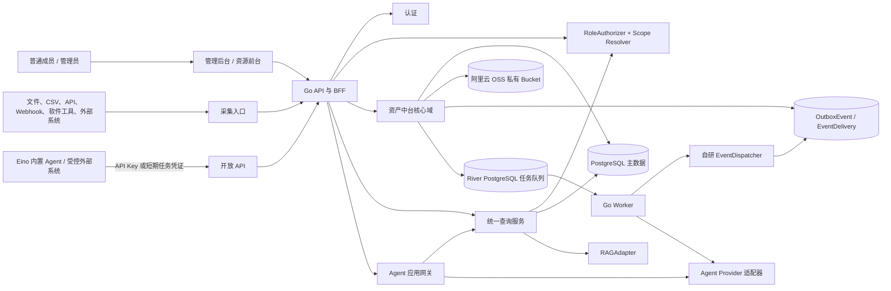
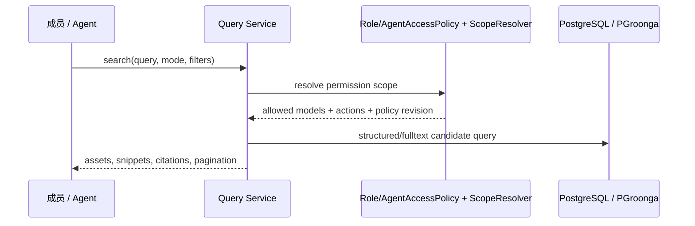

# 垂直领域高质量数据资产库

## 技术架构设计 v1.0

**依据**：`产品文档.md` v0.1  
**定位**：目标技术架构、组件边界和交付约束。实现拆分、接口与表结构设计均以本文为准。  
**设计方式**：本文一次性定义完整目标形态；第 15 节仅按技术依赖列出实施工作包，不能改变本文的数据、权限和集成边界。

---

## 1. 架构目标

本系统是企业垂直领域数据资产的权威中台。它将笔记、表单、文件、API、Webhook、软件工具和外部系统产生的原始信息，转换为可追溯、可发布、可授权、可检索和可被 Agent 使用的资产。

系统必须同时满足：

1. **数据权威性**：资产、版本、来源、关系、发布状态和权限均由本系统保存和裁决。
2. **动态建模**：管理员可配置资源模型、字段、表单、展示、发布与检索策略；普通成员无需理解表结构。
3. **统一授权**：后台、前台、问答、导出、开放 API 和 Agent 工具使用同一套工作区角色与资源范围规则。
4. **可信 Agent 接入**：Agent 是一种用户身份，通过 API Key 调用开放 API；Agent 应用是可被普通成员授权使用的服务资源。
5. **全文检索与引用**：资产支持 PGroonga 全文检索，结构化资产支持精确字段查询；结果带可核验引用。
6. **异步可靠性**：解析、Agent 整理、索引、任务回调和重试不丢失、不覆盖原始数据、可审计且可重放。
7. **可替换性**：外部 Agent 和对象存储均通过适配层接入，不侵入核心领域模型。

### 1.1 明确边界

本架构不自研基础大模型，不实现多企业隔离、字段级 ACL/加密、复杂审批会签、OAuth/SSO、多成员 RBAC 权限矩阵、跨企业数据共享和通用脚本执行器。

系统**必须**具备：资源模型级授权、完整版本血缘、结构化与全文检索、内置 Eino Agent（RAG、受限 ReAct、固定 Graph）、Agent 运行和审批恢复，以及由 River 和自研事件分发器驱动的可靠异步处理。首期权限只实现 `admin`、`editor` 两个成员角色；Agent 用户使用独立 `AgentAccessPolicy` 数据范围。

---

## 2. 不可变架构原则

| 原则 | 约束 |
| --- | --- |
| 主数据单一来源 | PostgreSQL 与对象存储是唯一权威来源。缓存、全文索引和 Eino 模型上下文均是派生数据或服务。 |
| 权限先于内容出口 | 任何数据出口都必须先确定调用主体和有效资源范围；索引不能绕开主数据权限。 |
| 模型即策略 | 字段、表单、发布、可见性、检索、API 和 Agent 出口策略归属于资源模型版本。 |
| 原始数据不可覆盖 | Agent 和人工编辑只产生新的不可变工作版本，绝不覆盖 `RawInput`。 |
| 发布状态简单明确 | 资产只使用 `internal -> published -> archived`；处理状态属于 `ProcessingJob`，不再扩展成资产审核工作流。 |
| 索引最终一致、授权强一致 | 索引可以异步；发布下线、停用用户、吊销密钥和资源权限收紧必须立即影响 API 结果。 |
| 适配器不反向控制业务 | Eino、对象存储和消息组件只能通过本系统接口或受控 Worker 访问数据。 |
| 单体优先、边界先行 | 使用模块化 Go 单体加独立 Worker。模块仅通过领域服务、数据库事务和领域事件协作。 |

---

## 3. 目标系统全景



**数据只能从核心域向检索投影单向同步。** Eino、普通用户和外部系统不允许直接连接 PostgreSQL 或对象存储。

---

## 4. 部署拓扑

### 4.1 核心部署单元

```text
Internet / 企业内网
        |
Reverse Proxy / TLS / WAF
        |
  +-----+-----------------------------+
  | React 前台 + 管理后台静态资源       |
  | Go API（可水平扩展）                |
  +-----+-----------------------------+
        |
  +-----+-----------------------------+
  | Go Worker（可水平扩展）             |
  | River：索引、解析、整理、调度、重试 |
  +-----+-----------------------------+
        |
  PostgreSQL + 阿里云 OSS 私有 Bucket
        |
        |
  Eino ModelEndpoint / 受控外部系统（仅 HTTPS API）
```

使用 Docker Compose 或等价的容器编排。API、Worker、PostgreSQL 和对象存储必须具有独立健康检查、日志与持久化卷。`Query Service` 是 Go API/BFF 进程内的逻辑模块，与外网 API 同进程部署；它保留独立包、指标和资源配额，未来可独立扩展但不改变 API 契约。

### 4.2 检索部署定位

检索能力随核心 PostgreSQL 服务部署，PGroonga 作为数据库扩展运行，不引入独立的检索子系统。

全文索引与主数据同侧执行，数据库备份、升级和资源监控纳入 PostgreSQL 运维基线。

PGroonga 全文投影是可重建的派生数据；其内容始终由 PostgreSQL 的已发布版本重建。生产环境中：

- 使用独立服务账号、网络策略和最小权限凭证。
- 附件对象存储固定使用阿里云 OSS，使用私有专用 bucket/prefix 与最小权限 RAM 服务凭证；不得授予整套业务附件桶之外的读写权限。
- 全文投影必须带本系统的 `asset_id`、`asset_version_id`、`resource_model_id` 与内容校验和。

### 4.3 自研 EventDispatcher 的位置

本系统使用自研领域事件分发能力：`PostgreSQL Outbox + EventDelivery + 自研 EventDispatcher + River`。状态变更、待投递记录和调度任务在同一事务内提交；Worker 通过 EventDispatcher 调用系统内登记的消费者并维护每一项投递状态。River 提供事务内入队、延迟、重试、Cron、唯一任务和执行状态。[River](https://github.com/riverqueue/river/blob/master/docs/README.md)

| 组件 | 本系统职责 |
| --- | --- |
| `OutboxEvent` | 不可变领域事件事实和重放源，不因消费成功而删除。 |
| `EventDelivery` | 一条事件到一个已登记消费者的投递状态、尝试次数、幂等键、错误和完成时间。 |
| 自研 `EventDispatcher` | 依据 `EventDelivery` 将事件分发给代码内登记的处理器；负责领用、幂等、重试编排、死信标记、人工重放和审计。 |
| River | 运行 `DispatchEventJob`、刷新全文投影、执行 Agent、回调重试和定时任务等具体工作。 |

`EventDispatcher` 是 Go 代码库中的内部组件，不提供跨系统消息协议、任意主题订阅或公共生产者接口。新增消费者必须在代码清单中声明唯一 `consumer_key`、接受的事件类型/版本、幂等策略和失败处置，并在进程启动时校验清单冲突。业务模块只调用统一 `EventStore.AppendTx`；该接口依据清单在当前业务事务内同时写入 `OutboxEvent`、对应的 `EventDelivery` 和 River 分发任务。新增消费者是否处理历史事件，必须由受审计的显式回放操作决定，不能在部署后隐式补投。这样保留可靠事件能力，同时把边界、权限和运维复杂度控制在本系统内。

---

## 5. 逻辑模块与职责边界

| 模块 | 责任 | 关键实体 | 禁止承担的责任 |
| --- | --- | --- | --- |
| Identity | 成员/Agent 用户、登录、会话、API Key、停启用 | User、ApiKey、Session | 资源授权决策 |
| Organization | 工作区、成员、邀请和两个成员角色 | Organization、Invitation、User、WorkspaceMember | 保存业务资产 |
| Authorization | 工作区角色、Agent 数据白名单、权限变更失效 | WorkspaceRole、AgentAccessPolicy、PolicyRevision | 直接写入资产 |
| Model Registry | 资源模型、字段、枚举、校验、表单布局、展示、发布策略与迁移 | ResourceModel、ResourceModelVersion、FieldDefinition、FormLayout、PublicationPolicy、ModelMigrationJob | 保存资产内容 |
| Asset CMS | internal 资产、版本、附件、关联、导入导出 | Asset、AssetVersion、Attachment、AssetRelation、ImportBatch、ExportJob | 执行 Agent 推理；不得自行维护 Block 树 |
| Content | Chat、笔记、文档、FAQ 和自定义 `content` 字段的容器、块、版本、复制、引用与合并 | ContentContainer、ContentContainerVersion、Block、BlockRevision、BlockPlacement、AssetVersionContentField | 保存普通结构化字段；绕过 Asset 权限直接暴露容器 |
| Lifecycle | 原始输入、处理任务、不可变资产版本、发布/归档 | RawInput、ProcessingJob、AssetVersion | 直接维护索引 |
| Retrieval | lexical/semantic/hybrid 检索、引用校验 | ProjectionRun、Chunk、Embedding、SearchSession、QueryLog | 成为主数据源 |
| Agent Orchestration | Agent 应用、成员启动会话、Eino 问答/Graph/ReAct、运行审计 | AgentApplication、AgentSession、AgentTask、automation.Run | 用长期密钥冒充普通成员 |
| Audit & Operations | 审计、索引状态、任务状态、指标、补偿操作 | AuditLog、OutboxEvent、ProjectionRun | 改变业务规则 |

实现时是一个 Go 仓库的独立内部包和数据库 schema；Worker 作为与 API 不同的进程启动，Query 是 API/BFF 进程内模块。任何模块不得跨模块直接读写表，必须经过模块服务接口或领域事件。

社群、论坛、帖子、评论及其他互动内容不属于本系统核心域，不建立对应的数据库实体、内部模块、前端页面或领域事件。后续社群由外部系统独立建设；外部系统通过单独定义的开放 API 契约访问本系统资产，权限按调用方 Agent 用户实时计算。

---

## 6. 数据架构与权威边界

### 6.1 存储分层

| 层 | 组件 | 保存内容 | 权威性 |
| --- | --- | --- | --- |
| 主数据层 | PostgreSQL | 用户、策略、模型、资产、版本、Markdown、结构化 JSONB、ContentContainer/Block 版本、来源、附件抽取文本、关系、发布、导入、任务、审计、事件和投递状态 | 唯一权威 |
| 附件层 | 阿里云 OSS 私有 Bucket | 原文件、上传媒体、处理结果、校验和 | 附件二进制权威来源；仅服务端凭证可访问 |
| 任务层 | River + PostgreSQL | 可执行任务、重试、调度、并发、任务状态 | 可靠执行状态 |
| 检索投影层 | PGroonga 全文投影 | 标题、正文与字段的全文索引 | 非权威，可重建 |
| 快速全文层 | PostgreSQL + PGroonga | 已发布内容的中文关键词、前缀、标签和 JSONB 字段检索 | 非权威，可重建 |
| 缓存层 | 进程缓存 | 会话、权限范围、限流、短期查询缓存 | 非权威，短 TTL |

中文全文搜索使用 PGroonga，语义召回使用 projection generation 下的 embedding。投影由 `asset.retrieval_projection_requested` 事件消费者维护 `retrieval.chunks`、`retrieval.chunk_embeddings` 和 `retrieval.projection_runs`；每个 chunk 保存 canonical 坐标和校验和。统一查询先在授权范围内执行 PGroonga/vector Top 100，hybrid 使用 RRF，前 50 个候选可交给本地 reranker，最终结果回到当前发布指针复核引用和权限。分页使用短期签名 search-session cursor。

### 6.2 核心实体关系

```text
Organization
  ├─ User (member | agent) ─ ApiKey / Session
  ├─ Invitation
  ├─ WorkspaceMember(admin | editor) ─ AgentAccessPolicy
  ├─ ResourceModel ─ ResourceModelVersion ─ FieldDefinition / FormLayout / ModelPolicy
  │    └─ Asset ─ AssetVersion ─ Attachment
  │          ├─ AssetVersionContentField ─ ContentContainer ─ ContentContainerVersion
  │          │                              └─ Block ─ BlockRevision / BlockPlacement
  │          ├─ AssetRelation
  │          └─ RetrievalProjection ─ ChunkRef
  ├─ RawInput ─ ProcessingJob ─ AssetVersion
  ├─ ImportBatch ─ ImportRow / SourceCursor / WebhookReceipt ─ RawInput
  ├─ ExportJob
  ├─ AgentApplication ─ AgentSession ─ AgentTask ─ automation.Run
  └─ AuditLog / OutboxEvent ─ EventDelivery ─ EventDeliveryAttempt
     QueryLog / ProjectionRun
```

Content 的核心版本链固定为四层：`Block`、`BlockRevision`、`BlockPlacement`、`ContentContainerVersion`。`ContentContainer` 只保存容器身份和当前版本指针；`message`、`paragraph`、`qa` 等均为 Block 类型，不再引入独立的消息块树、FAQ 正文表或额外快照层。

### 6.3 资产与版本模型

| 对象 | 设计要求 |
| --- | --- |
| `ResourceModel` | 资源表/数据模型，含模型版本、字段定义、表单、展示、默认可见性、检索/API/Agent 开关与发布策略。 |
| `Asset` | 逻辑资产身份，指向当前工作版本和当前发布版本。`publication_status` 只描述对外发布状态，不能用工作草稿状态覆盖；必须属于一个资源模型。 |
| `AssetVersion` | 不可变快照，保存标题、Markdown、普通结构化 JSONB、标签、来源、父版本、创建主体和版本类型；`type=content` 的字段通过 `AssetVersionContentField` 指向固定的 ContentContainerVersion，不把整棵 Block 树塞进 JSONB。处理中的版本由 `ProcessingJob` 记录，任何编辑或 Agent 输出都创建新版本。 |
| `RawInput` | 不可变原始输入，保存上传内容、来源 URL、导入批次、提交人、文件引用和初始校验结果；可关联多个资产或处理任务。 |
| `ProcessingJob` | 一次 Agent/解析处理的输入快照、模型/流程版本、输出候选版本、置信度、依据片段、错误、重试与人工处理记录。 |
| `AssetRelation` | 来源、引用、派生、去重、上下位、关联等关系，关系应能定位到源/目标资产版本。 |

`Asset.publication_status` 使用 `internal | published | archived`：新建和编辑版本先处于 `internal`，不可被默认检索出口返回；管理员或编辑显式发布时原子切换 `current_published_version_id`，旧版本仍保留历史；归档后不再作为当前结果返回。解析和 Agent 加工的进行中、成功、失败状态只记录在 `ProcessingJob`，不创建审核任务或质量状态机。

### 6.4 动态模型的数据库策略

系统字段（ID、标题、Markdown 正文、发布状态、版本、创建/更新时间、模型 ID）使用稳定列；普通领域字段保存在 `JSONB`。模型字段定义决定 JSON Schema 校验、输入控件、索引策略、唯一键、关联规则和对外 API 字段。`type=content` 是受控的非标量字段类型：它只保存字段与 ContentContainerVersion 的绑定，Block 内容由 Content 模块管理，且必须按 `allowed_block_types`、深度、顺序和必填角色校验。`markdown` 不自动升级为 `content`；`content` 不能作为普通 JSONB 等值/范围过滤字段，只能通过内容投影参与全文检索。模型策略必须为 `frontend`、`open_api`、`agent_tool`、`fulltext`、`export` 配置启停；每个出口同时检查当前发布指针、出口开关和授权。

`content` 字段只在资源模型显式声明后启用。创建或编辑资产版本时，Asset CMS 与 Content 模块在同一事务内创建/复制字段绑定和内容容器版本；发布、回滚、检索投影均按资产版本指向的容器版本读取。直接访问容器或 Block 的接口必须先回源校验资产、模型版本和调用主体权限。

每份资产版本记录 `resource_model_version`。模型变更不会重新解释历史数据；迁移由明确的模型迁移任务完成。高频过滤字段按模型配置创建受控表达式索引，不能让管理员直接注入任意 SQL。

字段、枚举、必填/唯一约束或出口策略的变更必须创建新的 `ResourceModel` 版本，并生成 `ModelMigrationJob`。迁移任务先提供影响预览和批量校验结果，再按批次写入新版本；无效字段、冲突记录和索引影响必须可定位、可重试，并保留原模型版本数据。迁移期间 API、表单和 Agent 工具明确绑定模型版本，不能把未完成迁移的数据当作新版本发布。

### 6.5 附件与文件安全

附件表保存对象 key、媒体类型、大小、SHA-256、上传人和来源版本。上传完成后附件可随版本发布，并通过 `frontend` 或 `agent_tool` 出口策略受控下载；两者都经本系统受控下载端点代理，每次请求都重新检查主体、资产当前发布状态、模型出口策略和资源模型读取权限。对象存储不向浏览器或外部 Agent 直接发放可在撤权后继续使用的预签名 URL。上传流程包含大小、类型、字节数和 SHA-256 校验。

### 6.6 批量导入、Webhook 与外部来源

`ImportBatch` 保存资源模型版本、字段映射、文件校验和、提交主体、导入策略、开始/完成时间和汇总结果；`ImportRow` 保存源行号、原始行 JSON、校验错误、生成的 `RawInput`/资产以及行级幂等键。CSV/XLSX 导入先按目标模型版本校验，合格行创建不可变 `RawInput`，错误行保留可下载的错误报告，不得以重试覆盖已接受的原始数据。导出使用与列表完全相同的 `PermissionScope` 和模型 `export` 策略，生成固定查询快照并审计；CSV/XLSX 单元格必须防止公式注入。

外部同步使用 `SourceCursor` 和来源系统、外部对象 ID、来源版本/更新时间组成的幂等键；Webhook 使用登记端点、签名密钥、时间戳窗口和重放 nonce 校验，原始请求保存为 `WebhookReceipt` 后再异步转换为 `RawInput`。软件工具、外部系统和定时同步均复用该来源模型，不能直接写 `AssetVersion`。

### 6.7 领域事件数据模型

`OutboxEvent` 为追加写入的领域事实，至少包含 `event_id`、`event_type`、`payload_version`、`aggregate_type`、`aggregate_id`、`aggregate_version`、`organization_id`、`occurred_at`、最小 payload 与 `payload_checksum`。事件记录不因投递完成而删除，并遵循审计保留策略。

`EventDelivery` 表示一个事件交给一个内部消费者的可靠投递，至少包含 `event_id`、`consumer_key`、`status`、`attempt_count`、`next_attempt_at`、`lease_token`、`lease_until`、`last_error_code`、`last_error_summary`、`completed_at`。数据库必须具有唯一约束 `(event_id, consumer_key)`，状态仅可按 `pending → processing → succeeded | retry_wait | dead` 迁移；`retry_wait` 只能在到达 `next_attempt_at` 后重新领用。

`EventDeliveryAttempt` 追加保存每次领用、开始、完成、失败分类、耗时、处理器版本和追踪 ID。Dispatcher 使用 `SELECT ... FOR UPDATE SKIP LOCKED` 或等价的条件更新领取待处理记录，领取和租约更新时间在短事务中完成。租约过期的 `processing` 记录由恢复任务转回 `retry_wait`；死信记录只能由有权限的运营操作显式重放，重放必须保留原事件与历史尝试。

当前实现由 `internal/eventing`、`internal/store/delivery.go` 和 `internal/worker` 提供 PostgreSQL Outbox 事实记录、EventDelivery 状态机、River 事务内分发任务、租约、退避重试、死信和尝试记录。业务模块统一调用 `EventStore.AppendTx`，按消费者清单在当前事务中写入 OutboxEvent、EventDelivery 和按 `event_id` 唯一的 `event.dispatch` River Job；Worker 由 River 的 LISTEN/NOTIFY 唤醒并运行周期恢复任务，扫描领用超时、等待重试或调度作业意外丢失的事件。当前检索消费者为 `retrieval.projection`：它在同一 projection run 内写入确定性 chunks、embedding 和计数，Embedding 故障只让 semantic/hybrid 降级，不阻断 lexical；Agent 处理读取不可变源版本，执行前重新检查绑定 Agent 用户的 `read` 与 `edit` 白名单，输出只创建 `internal` 版本。

---

## 7. 认证与授权架构

### 7.1 身份认证

本系统仅采用本地身份认证，不接入也不预留 LDAP/AD、OIDC、SAML、企业 SSO 或 Keycloak。认证方式如下：

| 主体 | 认证方式 | 说明 |
| --- | --- | --- |
| 匿名用户 | 无凭证 | 仅能访问 `public` 模型中已发布且允许前台出口的数据。 |
| 普通成员 | 账号密码 + 安全会话 Cookie | 密码使用 Argon2id；会话使用 HttpOnly、Secure、SameSite 保护。 |
| Agent 用户 | 命名 API Key | 仅保存不可逆哈希与前缀，支持到期、吊销、限流和最后调用时间。 |
| 任务运行 | 短期任务凭证 | 绑定 automation.Run、操作白名单、过期时间与幂等键，不可换取长期 API Key。 |

用户、工作区成员角色、资源模型和 Agent 数据白名单均由本系统维护和管理。

### 7.2 首期授权模型

首期不实现 OAuth/SSO、部门、用户组、角色继承或完整 RBAC 矩阵。成员只有 `admin` 和 `editor` 两个工作区角色；Agent 用户是技术身份，使用独立 `AgentAccessPolicy` 白名单。内部可保留授权接口抽象，但对外只暴露这两个角色和 Agent 的资源模型/动作配置。

AgentAccessPolicy 的最小结构：

```ini
agent_id | resource_model_id | actions[] | enabled
```

约定：

- 成员角色决定能否选择和调用 Agent 应用；AgentAccessPolicy 决定工具能访问哪些资源模型和动作。
- Agent 工具调用不得继承发起成员的数据范围，也不得接受客户端传入的资源范围。

### 7.3 授权与 SQL 范围过滤的协作

授权判断不能逐条资产调用复杂策略。授权粒度是工作区角色、资源模型和 AgentAccessPolicy，记录、字段和附件继承范围。因此建立 `ScopeResolver`：

```text
请求主体
  → 解析工作区角色或 AgentAccessPolicy 的有效动作
  → ScopeResolver 计算允许的资源模型 ID 集合
  → Query Builder 生成 WHERE resource_model_id IN (...) 等范围条件
  → 数据库/检索候选查询
  → 授权适配器点校验 + 主数据状态/版本复核
```

实现要求：

1. `ScopeResolver` 根据工作区角色或 AgentAccessPolicy 计算 `PermissionScope`，不维护部门、群组或角色继承。
2. `PermissionScope` 带 `policy_revision`；成员角色、Agent 白名单、用户状态或 API Key 变化时失效。
3. 列表、搜索和导出先使用 SQL 范围缩小集合；详情、写入、下载、发布和最终检索结果再执行点校验。
4. 所有 SQL 使用参数化数组、临时表或 CTE，不拼接模型 ID；空范围即拒绝访问。

模型出口策略只控制功能是否启用，不替代成员角色或 AgentAccessPolicy。查询、导出、下载与 Agent 工具调用的固定顺序为：认证主体 → 工作区角色/AgentAccessPolicy → 当前发布指针 → 出口开关 → 最终对象点校验。任一环节拒绝即不返回存在性、数量或候选信息。

示例：

```sql
SELECT a.id, a.current_published_version_id
FROM asset.assets AS a
WHERE a.publication_status = 'published'
  AND a.current_published_version_id IS NOT NULL
  AND a.resource_model_id = ANY($1::uuid[])
  AND a.organization_id = $2;
```

这是把工作区角色和 AgentAccessPolicy 的模型级授权结果安全、高效地应用于集合查询。最终返回内容仍以当前主数据、有效主体和最新策略决策为准。

### 7.4 Agent 应用使用权与数据权限

Agent 用户和 Agent 应用的职责必须分离，二者不是权限交集：

| 决策 | 规则 |
| --- | --- |
| 外部服务可读取/写入什么 | 该 **Agent 用户** 的 `AgentAccessPolicy` 动作与资源模型范围。 |
| 普通成员能否看到/启动服务 | 该成员是否拥有 `agent.use` 对 `AgentApplication` 的权限。 |
| Eino Tool 查询与问答上下文 | 绑定 **Agent 用户** 的实时白名单 ∩ 已发布 ∩ 模型 `agent_tool` 策略；不与前台成员的资源读取范围取交集。 |
| Agent 写回是否可发布 | 任务操作白名单 ∩ AgentAccessPolicy 的 `publish` 动作。 |

成员身份只用于校验和审计 `agent.use`，并记录为问答发起者；它不能被 Eino Tool 作为数据授权凭证，也不会限制已启动 Agent 应用的数据范围。回答中的资产链接、附件下载和资源详情请求仍以点击成员自己的读取权限重新判断，避免将 Agent 回答变成资源前台的越权入口。API Key 只证明 Agent 用户身份，不附带额外授权。停用 Agent 用户、吊销密钥或收紧其资源模型策略后，后续工具调用立即失败或收紧。

---

## 8. 检索架构

### 8.1 检索职责划分

| 能力 | 实现 | 输出 | 权限边界 |
| --- | --- | --- |
| 结构化查询 | PostgreSQL JSONB/表达式索引 | 资产 ID、字段、分页结果 | 先按 `PermissionScope`、发布指针与对应出口策略限定，再复核。 |
| 中文全文检索 | PGroonga | 候选资产/片段 ID 与关键词分数 | 仅索引满足 `fulltext` 策略的当前发布版本及其附件抽取文本；返回前复核。 |
| 全文检索 | PostgreSQL + PGroonga 投影 | 资产 ID、版本、评分、摘要和分页结果 | 查询在 SQL 内限定组织、模型范围、当前发布指针与 `fulltext`、`agent_tool` 出口。 |
| 引用生成 | Query Service | 资产 ID、版本、标题、来源、片段定位 | 从主数据读取并按当前权限裁剪。 |

当前运行时只提供结构化和 PGroonga 全文检索；语义能力通过可选 Retriever 适配器提供。PostgreSQL、模型出口策略与工作区角色/AgentAccessPolicy 共同构成最终访问裁决。

### 8.2 全文检索投影模型

```text
当前发布指针切换到 AssetVersion
  → AssetProjectionRequested 领域事件
  → River IndexAssetVersionJob
  → 汇总标题、Markdown 与 JSONB 字段
  → 确认它仍是当前发布指针且仍满足全文检索出口策略
  → PGroonga 全文投影幂等写入

Asset 下线、删除、权限收紧或发布版本替换
  → AssetProjectionRevoked 领域事件
  → PGroonga 投影删除或失效
  → 主数据查询即时停止返回；索引删除允许异步完成
```

### 8.3 统一查询流程



当前查询只提供结构化和 PGroonga 全文模式。结果直接从 PostgreSQL 当前发布指针回源，并在 SQL 中执行组织、模型范围和出口策略过滤；未授权资产不进入响应。

查询上下文必须明确标记主体类型：资源前台与管理后台使用成员/匿名主体；Eino Tool 或其他受控 Agent 调用使用绑定 Agent 用户主体；任务 API 使用短期任务凭证所绑定的 Agent 用户主体。前台成员对 `AgentApplication` 的 `agent.use` 判定只发生在启动会话时，绝不被隐式带入 Agent 工具检索范围。

### 8.4 全文投影失败与重建

- PGroonga 投影失败由 River/EventDelivery 重试或进入死信；投影按资产版本幂等重建。
- `/readyz` 只检查数据库连通性。
- 索引失败不回滚已发布资产；由 River 指数退避重试并提供全文投影重建入口。
- 重复事件按 `asset_version_id + content_checksum` 幂等。
- 灾备时扫描 PostgreSQL 所有当前发布版本重建全文投影，不改变资产版本。

---

## 9. 生命周期与 Agent 加工

### 9.1 原始输入到发布版本

```text
采集/录入
  → RawInput（原文、附件、来源、提交者不可变留存）
  → 格式/模型字段校验
  → 创建 internal AssetVersion
  → 可选 Agent ProcessingJob 读取不可变源版本并生成新的 internal AssetVersion
  → 管理员或编辑显式发布，原子切换 Asset 当前发布指针
  → Outbox 事件 + River 索引任务
  → PGroonga 全文检索投影
  → 前台、问答、开放 API 在权限内可见
```

用户和 Agent 的写入结果默认进入 `internal`。是否允许 Agent 直接发布由 AgentAccessPolicy 的 `publish` 动作决定；管理员或编辑也可以显式发布。发布前必须完成字段、附件和处理结果校验；发布事务原子切换指针，旧发布版本继续保留历史。归档后不再作为当前查询结果返回。

### 9.2 Agent 处理任务

Agent 整理任务的输入是不可变版本快照，输出是候选版本或处理报告。任务记录：输入资产/版本、引用片段、Agent 应用、模型/流程版本、字段差异、置信度、错误、重试和人工处置。

Agent 永远不能直接修改已经发布的版本。即使 Agent 有发布权限，也只能发布自己产生、符合模型规则且具有完整处理记录的候选版本。

### 9.3 外部社群系统边界

本系统不建设社群、论坛、帖子、评论、点赞、收藏、举报或社群内容审核，不维护 `Community`、`Post`、`Comment` 等实体，也不为这些内容建立内部索引、队列或权限对象。

后续外部社群系统独立负责社群内容和互动关系；如需读取或回写本系统资产，使用单独定义的开放 API 契约，并以外部系统绑定的 Agent 用户作为调用主体执行 AgentAccessPolicy 校验。本系统只保证资产、附件、检索、任务和审计边界。

---

## 10. 异步、事件与调度架构

### 10.1 River、Outbox 与 EventDispatcher 的共同使用

每次影响检索投影、异步处理或跨模块反应的业务写入，在**同一个 PostgreSQL 事务**中完成：

```text
写 Asset / AssetVersion / 策略 / 发布结果
  + 写 AuditLog
  + 写 OutboxEvent（不可变领域事件）
  + 写 EventDelivery（每个登记消费者一条待投递记录）
  + River InsertTx(DispatchEventJob，按 event_id 唯一)
  = 一次事务提交
```

这样事务回滚时业务数据、审计、事件、投递记录和调度任务都会回滚；事务提交后 River Worker 才可见任务。`OutboxEvent` 保留事件事实和重放源；`EventDelivery` 是投递状态机；River 负责可靠地唤起分发和执行工作。

`EventDispatcher` 的处理流程为：River 取出 `DispatchEventJob`，在短事务中领用尚未完成的 `EventDelivery`，校验该消费者接受的事件版本，调用已登记的 Go handler，并在独立事务中写入成功、可重试失败或死信状态。该链路提供**至少一次投递**，不宣称分布式恰好一次；处理器必须将 `event_id` 作为幂等键。需要耗时操作时，handler 只创建下游 River Job，再由该 Job 执行外部调用。定时 `RecoverPendingDeliveryJob` 扫描领用超时和等待重试的投递记录，保证调度任务意外丢失时仍可恢复。

### 10.2 领域事件

事件使用版本化信封：

```json
{
  "event_id": "uuid",
  "event_type": "asset.version_published",
  "aggregate_type": "asset",
  "aggregate_id": "uuid",
  "aggregate_version": 12,
  "organization_id": "uuid",
  "occurred_at": "timestamp",
  "payload_version": 1,
  "payload": {
    "asset_version_id": "uuid",
    "content_checksum": "sha256",
    "resource_model_version": 7
  }
}
```

最少事件类型：

```text
raw_input.created
asset.version_created
asset.version_published
asset.version_archived
asset.archived
asset.deleted
resource_model.policy_changed
authorization.policy_changed
processing.requested
processing.completed
import.completed
import.failed
agent_task.requested
```

事件 payload 不应包含长期密钥和不必要的完整正文，但必须包含消费者处理所需的不可变标识：`asset_version_id`、`content_checksum`、`resource_model_version` 或相应的投影世代。Worker 根据事件中的版本 ID 回主数据读取不可变快照，而不是读取不确定的“当前快照”；执行前比较当前发布指针和模型策略版本，过期事件只执行必要的撤销/补偿并记录为过期，不得覆盖更新版本投影。`EventDelivery` 是消费者幂等和投递审计的唯一记录，重复投递不重复创建资产、不重复索引或重复回写结果。

最少登记消费者：

| `consumer_key` | 消费事件 | 动作 |
| --- | --- | --- |
| `retrieval-projection` | 资产版本发布、下线、授权范围收紧 | 按事件指定的版本/校验和创建或撤销 PGroonga 全文投影 Job。 |
| `policy-cache` | 策略、主体绑定、用户状态变更 | 推进 `PolicyRevision` 并使 API/查询授权缓存立即失效。 |
| `agent-task` | Agent 任务创建、到期、取消 | 创建、取消或唤起相应 Agent Job。 |
| `operation-notice` | 任务失败、死信、投影失败 | 写入运营待处理项和告警事件。 |

### 10.3 River 队列设计

| 队列 | 任务 | 并发/幂等策略 |
| --- | --- | --- |
| `event-dispatch` | `DispatchEventJob`、投递恢复、死信重放 | `event_id + consumer_key` 唯一；领用超时后恢复。 |
| `ingestion` | 文件元数据、CSV/XLSX 行处理、Webhook 转换 | 附件按 SHA-256；导入行按批次 + 行键；来源同步按外部 ID + 版本唯一 |
| `processing` | Agent 整理、去重、候选版本生成 | 按输入版本 + 处理规则版本唯一 |
| `retrieval` | PGroonga 全文投影刷新、删除和重建 | 按资产版本 / checksum 唯一 |
| `agent_runtime` | Eino ChatModel、Tool 和 Graph 调用 | 超时、熔断、可重试 |
| `scheduled` | Cron、事件触发和手动 AgentTask | 按运行 ID 与业务幂等键唯一 |
| `maintenance` | 清理短期凭证、过期签名、索引补偿、审计归档 | 限速执行 |

队列隔离可防止大文件解析或慢 Agent 回调耗尽发布和读取能力。所有外部调用设置连接、请求和总任务超时；重试采用指数退避、最大次数、死信状态和人工重试入口。

### 10.4 Agent 定时任务

`AgentTask` 仅可选择代码登记过的固定 Workflow 操作，不能保存任意 SQL、任意 HTTP URL 或外部回调地址。一次运行：

```text
Scheduler 创建统一 automation.Run
  → 固定 Eino Graph / 受限 ReAct 执行
  → 每个节点实时检查 AgentAccessPolicy 与 workspace
  → 记录输入快照、输出、引用、Tool、耗时、错误与重试
```

权限收紧发生在任务运行中时，后续读写立即失效。每个副作用节点使用 `run_id + node + tool_call_id` 幂等键，重试不能产生重复资产、发布或事件。

---

## 11. API 与外部集成

### 11.1 API 分组

| API | 认证 | 主要用途 |
| --- | --- | --- |
| `/api/admin/*` | 成员会话 + 工作区角色 | 模型、资产、发布/归档、成员、Agent、索引和运维管理；`POST /api/admin/agent-users` 创建 Agent 技术身份，`POST /api/admin/agent-users/{agentUserId}/api-keys/rotate` 撤销旧 Key 并一次性返回新 Key，`PUT /api/admin/agent-users/{agentUserId}/access-policy` 替换资源模型动作白名单，`GET /api/admin/agent-applications*` 查看应用绑定和 Key 有效性，`PATCH /api/admin/agent-applications/{applicationId}/status` 控制应用启停。 |
| `/api/frontend/agent-applications/*/sessions` | 成员会话 + `agent.use` | 启动指定 Agent 应用并创建短期会话；不把成员数据权限传给 Eino。 |
| `/api/frontend/agent-sessions/*/references/validate` | 成员会话 + AgentSession | Eino 返回答案后按绑定 Agent 用户实时权限、当前发布版本和 `agent_tool` 出口二次校验引用；成员权限不参与数据范围计算。 |
| `/api/frontend/agent-sessions/*/chat` | 成员会话 + AgentSession | 使用应用绑定的 ModelEndpoint 执行 Eino RAG；成员只选择 Agent 应用，数据权限和引用过滤由绑定 Agent 用户决定。 |
| `/api/frontend/agent-sessions/*/chat/stream` | 成员会话 + AgentSession | 以 SSE 返回 Eino 答案增量；`complete` 事件中的引用经过绑定 Agent 用户权限复核，错误通过 `error` 事件返回。 |
| `/api/frontend/*` | 匿名或成员会话 + RoleAuthorizer | 资源目录、详情、搜索、问答、我的提交；自定义 `content` 字段的读取和编辑必须按资产版本授权。 |
| `/api/open/v1/*` | API Key + AgentAccessPolicy + 限流 | Agent 用户和受控外部系统的查询、引用、资产写入、单资产 `prepare_asset` 任务和 OpenAPI 描述；统一 Run 的尝试与完成错误写入 automation 表。自定义 `content` 字段只能通过字段级 Content API 访问，不能把容器 ID 当作独立数据权限。 |
| `/api/tasks/*` | 短期任务凭证 + 白名单 + AgentAccessPolicy | 任务输入读取、输出写回与运行状态。 |
| `/api/internal/*` | 服务身份 + 网络策略 | Worker、健康检查和受控检索后端适配操作；不得对公网暴露。 |

社群、论坛及互动内容不属于上述 API 的首版资源。后续外部社群系统如需接入，必须单独定义 OpenAPI 路径、请求模型、权限映射、幂等和审计要求；不得在本系统内补建社群业务实体或绕过 Agent 用户权限。

OpenAPI 文档应按调用 Agent 用户的实际有效权限动态返回可用操作和模型字段。文档本身不能成为未授权模型/字段的枚举入口。第一版外部 Agent 接口草案维护在 `openapi-open-v1.yaml`；成员会话保护的 Agent 管理接口维护在 `openapi-admin-v1.yaml`，其路径、请求/响应和错误码是实现契约，变更必须同步本架构与产品文档。

目标实现提供 Agent 资产创建、编辑、处理、发布和归档，以及统一 `POST /api/open/v1/query`（lexical/semantic/hybrid、引用字段和 search-session cursor）、资产引用详情和单资产 `prepare_asset` 任务。检索结果始终由当前发布指针、AgentAccessPolicy、出口策略和 chunk 校验回源裁决；旧查询路径已删除。

所有会创建、更新、提交、发布、回复或导入数据的外部写入接口必须接受 `Idempotency-Key`。服务端以调用主体、操作、目标资源范围和请求规范化摘要绑定幂等记录；同一键与不同请求摘要返回冲突，网络重试返回首次执行结果。浏览器表单使用乐观锁版本号，批量导入和来源同步使用其各自的行/来源幂等键，不能只依赖 AgentTask 的任务级幂等。

### 11.2 内置 Eino Agent

每个 `AgentApplication` 绑定一个组织级 `ModelEndpoint`，由 `ModelRegistry` 按 endpoint/revision 缓存 Eino ChatModel。`rag` 模式执行受权限过滤的检索后生成回答，`react` 模式使用 ChatModelAgent 和受限 Tool Registry，`workflow` 模式执行 Go 代码注册的固定 Graph。模型凭证使用应用层加密或 Secret Provider，API/Worker 共享同一配置和 PostgreSQL CheckPointStore。

`POST /api/frontend/agent-sessions/{sessionId}/chat` 和 `/chat/stream` 提供 RAG 会话；ReAct 使用持久化 Run、事件 SSE、resume/cancel 接口。高风险 Tool 通过 Stateful Interrupt 创建 Interaction，恢复前重新校验 AgentAccessPolicy、资源版本、输入 checksum 和 ModelEndpoint revision。模型上下文、Tool 参数和引用始终由本系统过滤，模型不能直接访问数据库、OSS 或任意 URL。

### 11.3 适配器接口

```go
type ObjectStore interface {
    Put(ctx context.Context, object Object) (ObjectRef, error)
    Open(ctx context.Context, ref ObjectRef) (io.ReadCloser, ObjectMetadata, error)
}

type DownloadAuthorizer interface {
    AuthorizeAndStream(ctx context.Context, subject Subject, attachmentID uuid.UUID) (io.ReadCloser, DownloadMetadata, error)
}
```

核心业务层只依赖这些接口。Eino ModelEndpoint adapter 和 `AliyunOSSObjectStore` 等具体实现通过适配器注册；对象存储的第一版和部署基线只支持阿里云 OSS，不承诺兼容 S3/MinIO。下载端点经 `DownloadAuthorizer` 实时授权后再从 `ObjectStore` 流式读取。每个适配器必须提供超时、重试分类、熔断、指标和结构化日志。

---

## 12. 前端与动态表单架构

前端使用 React + Vite + Ant Design，分别提供后台和资源前台，但共享设计令牌、身份、API SDK 和权限感知组件。

| 前端区域 | 核心能力 |
| --- | --- |
| 工作台 | internal、处理/索引失败、任务运行、近期审计与快捷入口。 |
| 笔记与文档 | Markdown 编辑、自动保存、附件、标签、预览、发表与发起整理。 |
| 资源表 | 模型驱动列表、筛选、导入、批量操作、版本与前台预览。 |
| 模型配置 | 字段、布局、唯一键、索引、Agent 与检索/API 策略；`content` 字段额外配置允许块类型、深度和结构约束。 |
| 版本与血缘 | 原始输入、internal/已发布版本、差异、引用依据和处理记录。 |
| 权限管理 | 管理员/编辑角色、AgentAccessPolicy、生效范围预览与审计。 |
| Agent 运维 | AgentApplication、接入信息、健康状态、调用日志、任务定义与运行记录。 |
| 资源前台 | 目录、搜索、详情、问答和我的提交。 |

动态表单使用 React Hook Form + Zod，字段渲染通过受控字段注册表实现。模型 JSON Schema 由服务端校验并下发；前端只负责体验增强，不能成为唯一校验方。`markdown` 使用 CodeMirror 6 与统一的 Markdown 渲染/消毒链路；`content` 使用 Block 编辑器和服务端 Block schema，不能把编辑器私有 JSON 直接当作权威正文格式。

---

## 13. 安全、可靠性与可观测性

### 13.1 安全控制

- 全链路 TLS；服务间使用私网、服务账号和最小网络访问规则。
- 密码使用 Argon2id；API Key、回调密钥和短期凭证只保存哈希或加密密文；密钥只在创建/轮换时明文显示一次。
- 默认拒绝。权限、发布、下线、导出、密钥轮换、Agent 应用回调地址和索引重建属于高风险操作，需确认和审计。
- API Key 以用户、IP/客户端、接口和资源成本维度限流；问答与全文搜索有独立配额和超时。
- 文件上传执行类型、大小和 SHA-256 校验；附件只通过受控下载接口读取。
- 下载、预览和导出在每次请求时重新授权；业务附件桶不对浏览器、Eino 或外部 Agent 开放直连路径。导入错误报告和导出文件同样属于受控资源并设置短保留期。
- Agent 回调地址必须通过 allowlist/DNS/IP 校验和 SSRF 防护；不允许用户配置内网、元数据地址或任意协议。
- 日志中脱敏 API Key、Authorization、正文及敏感字段；审计记录主体、动作、目标、结果和追踪 ID。

### 13.2 一致性与恢复

| 场景 | 保证 |
| --- | --- |
| 资产写入、事件与任务创建 | 同一 PostgreSQL 事务，写入 OutboxEvent、EventDelivery，并使用 River `InsertTx` 创建分发任务。 |
| 重复 Worker / Dispatcher 执行 | `(event_id, consumer_key)` 唯一约束、EventDelivery 租约、事件 ID、输入版本、投影 checksum 和写入幂等键保证可重复处理。 |
| 分发任务丢失或进程中断 | `RecoverPendingDeliveryJob` 扫描未完成、租约过期和到期重试的投递记录；死信需受控人工重放。 |
| 全文索引滞后 | 主数据权限/状态即时生效；查询最终复核；异步删除或刷新投影。 |
| 发布版本与工作版本并存 | `current_published_version_id` 保持旧发布内容可见；工作版本状态不参与对外读取，显式发布后才原子切换发布指针。 |
| 权限收紧后的下载 | 受控下载端点在请求时重新授权，不签发可跨撤权继续使用的外部对象存储 URL。 |
| 乱序或过期事件 | 消费不可变版本 ID、校验和与投影世代；比较当前发布指针，过期事件不覆盖较新投影。 |
| Agent 回调超时 | 任务可重试，幂等键避免重复写入；保留运行快照和失败原因。 |
| 人工与 Agent 并发编辑 | `AssetVersion` 不可变 + 乐观锁；冲突创建新候选或要求人工合并。 |
| PostgreSQL/对象存储恢复 | 定期备份、PITR/版本化；全文投影从已发布主数据重建。 |

### 13.3 可观测性

使用 OpenTelemetry 贯穿 HTTP 请求、角色/AgentAccessPolicy 决策、SQL、EventDispatcher、River Job 和 Eino 模型调用；日志携带 `request_id`、`trace_id`、`asset_id`、`version_id`、`event_id`、`consumer_key`、`delivery_id`、`job_id`，但不得记录受限正文。

至少监控：

```text
API P50/P95/P99、错误率、认证失败、授权拒绝
RoleAuthorizer/ScopeResolver 延迟与策略缓存失效
EventDispatcher 待投递量、领用租约超时、重试、死信、重放和消费者处理耗时
River 队列深度、重试、死信、任务耗时
全文投影积压、索引新鲜度、检索延迟
全文检索命中率与引用有效率
Agent 调用量、成功率、超时、限流与成本
发布到可检索的延迟、处理成功率
对象存储、文件解析、数据库连接和备份状态
```

---

## 14. 技术选型基线

| 层级 | 选型 | 选择理由 |
| --- | --- | --- |
| 前端 | React + Vite + Ant Design + TanStack Query | 适合高密度 CMS、表格、筛选、版本发布和运营后台。 |
| 文档编辑 | CodeMirror 6 + Markdown 渲染/消毒 | 文档权威格式是 Markdown，便于版本、检索和 Agent 处理。 |
| 动态表单 | React Hook Form + Zod + 字段注册表 | 复杂模型策略是产品核心，保留可控扩展和服务端校验。 |
| 后端 | Go + Gin + pgx + sqlc + OpenAPI 代码生成 | 适合事务、并发 Worker、类型安全 SQL 与清晰 API 契约。 |
| 主数据 | PostgreSQL + JSONB | 动态字段与关系/事务并存，单一权威数据源。 |
| 授权 | RoleAuthorizer + AgentAccessPolicy + ScopeResolver | 首期只实现 admin/editor 和 Agent 白名单；ScopeResolver 将策略安全编译为集合查询范围。 |
| 文件 | 阿里云 OSS Go SDK V2 | 附件可靠保存，下载由业务 API 鉴权后流式转发。 |
| 领域事件与异步 | PostgreSQL + OutboxEvent + EventDelivery + 自研 EventDispatcher + River | 事务内记录事件和投递，可靠分发、重试、重放、Cron、唯一任务与执行状态均可审计。 |
| 中文全文 | PGroonga | 中文、标签、前缀和 JSONB 检索与 PostgreSQL 主数据同侧执行。 |
| Agent | Eino ChatModel + ChatModelAgent + ToolsNode + 固定 Graph | Eino 负责编排和生成，本系统负责授权数据、检索、引用和业务副作用。 |
| 可观测性 | OpenTelemetry + Prometheus + Grafana + Loki | 统一追踪 API、任务、检索和 Agent 调用。 |

不采用：LDAP/AD、OIDC、SAML、企业 SSO、Keycloak、独立消息中间件、Redis 作为任务队列、OpenSearch 独立业务搜索、Kubernetes、Temporal。系统不为这些组件维护适配层或部署预留。若未来增加语义后端，必须先定义独立的投影、权限回源和重建契约，不能形成第二套权威数据源。

---

## 15. 实施工作包与验收门槛

本文定义的是完整目标架构；以下工作包只按依赖关系组织实施，不代表产品范围、架构能力或运行环境的分级。每个工作包都必须保留前述边界，不能以临时直连数据库或跳过 AgentAccessPolicy 换取速度。

### 工作包 A：领域与安全底座

- Go 项目骨架、PostgreSQL schema、迁移、对象存储和 API 契约。
- 用户、`admin/editor` 工作区角色、Agent 用户、会话和 API Key。
- AgentAccessPolicy、策略管理、`ScopeResolver`、策略版本失效与授权审计。
- 资源模型、字段定义、通用文档/笔记、FAQ、经典镜头模型、Asset/AssetVersion/RawInput，以及三态发布状态、发布指针和出口策略。
- ContentContainer、Block 及其不可变版本；自定义模型 `content` 字段与资产版本的绑定、字段级 Block 校验和内容投影。
- ImportBatch/ImportRow、外部来源幂等、Webhook 签名与重放防护、受控导出。
- River、Outbox、审计日志和基础 Worker。

**验收**：管理员与编辑在角色边界内访问资源；撤销 AgentAccessPolicy 后下载立即失败；已发布资产编辑和新版本发布不会让旧发布版本消失；原始输入和版本不可覆盖；API、导入与来源同步的重复请求不重复写入。

### 工作包 B：发布与检索

- internal 版本、显式发布/归档、Agent 发布白名单与处理报告。
- PGroonga 投影、结构化/全文检索、查询审计。
- PGroonga 全文检索投影、发布版本回源和跨组织权限出口集成测试。
- 索引失败重试、手动补偿、全文投影全量重建和检索可观测性。

**验收**：资产下线或权限收紧后立即从结构化和全文查询结果消失；全文投影可由 PostgreSQL 的资产版本重建。

### 工作包 C：Agent 应用与自动化闭环

- AgentApplication、ModelEndpoint、前台问答、应用使用权与 Agent 数据权限分离、答案引用二次校验。
- 统一 OpenAPI、动态可调用操作说明、限流、查询/调用审计。
- AgentTask、短期任务凭证、文档整理和外部系统回写模板、幂等回写。

**验收**：Eino 没有本系统数据源直连权限；成员只能启动具有 `agent.use` 的应用，Tool 查询严格使用绑定 Agent 用户的实时权限且不与成员资源范围取交集；任务权限在运行中收紧后，后续读取/写入立即失败。

### 工作包 D：外部接入、运维与完整性验证

- 外部系统 Open API 接入验证、运营首页、告警和备份演练；不建设社群内容和互动模型。
- 压测查询、权限、River 队列、PGroonga 索引与 Agent 回调；建立容量与成本基线。
- 验证 EventDispatcher 在多个内部消费者、失败重试、死信重放和重复投递下的正确性；不改变事件契约。
- 交付前执行 `scripts/acceptance.cmd`，统一验证 API 健康、全量 Go 测试、可选真实 PostgreSQL/PGroonga 联调和 Docker 构建；生产备份恢复、压测和告警阈值必须在正式部署规格上单独演练。

**验收**：索引、任务、权限、Agent 调用和审计均可观察、可补偿；故障恢复后可由主数据重建检索投影。

---

## 16. 实施前需要确认的参数

以下参数不改变架构，但会决定具体容量与实现细节：

1. 经典镜头模型的字段、枚举、唯一键、质量规则和典型查询样本。
2. 每日上传量、单文件大小、Office/PDF/视频比例、保留期与数据合规边界。
3. PostgreSQL/PGroonga 的索引容量、备份策略和升级窗口。
5. 统一 OpenAPI 的正式请求/响应 schema、分页、排序、过滤表达式和 Eino Tool 定义。
6. Agent 回调网络可达性、固定出口/入口、域名 allowlist、超时和并发上限。
7. 可用性目标、RPO/RTO、备份频率、审计保存周期和告警值。

---
